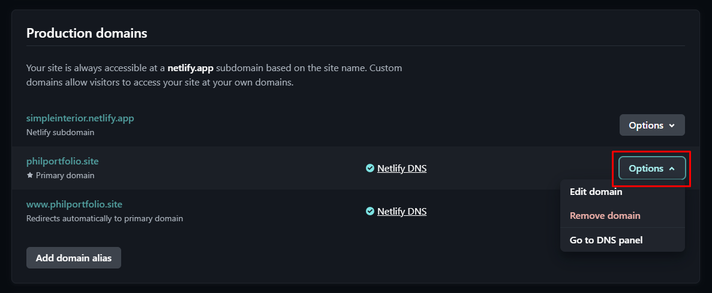
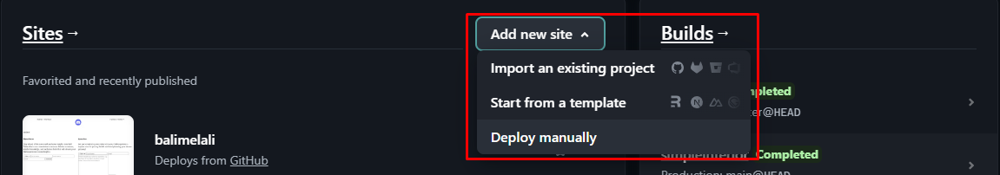

---

## Responsive Design:

Responsive Design pada website ini terbagi menjadi 3 bagian yaitu:

| Device | Orientation | Min-width | Max-Width |
| ------ | ----------- | --------- | --------- |
| Phone  | Potrait     | ~         | 480px     |
| Tablet | Landscape   | 480x      | 1024px    |
| PC     | Landscape   | 1024px    | ~         |

---

## Deployment Step

### Melepaskan koneksi domain dengan website yang lama

Karena domain [https://philportfolio.site](https://philportfolio.site) sudah digunakan untuk website lain, maka yang harus dilakukan pertama kali adalah melepaskan koneksi antara website netlify dengan domain yang ingin digunakan(link dipakai salah satu web di netlify). Langkah-langkahnya adalah sebagai berikut:

1. Buka dashboard netlify
2. Pilih website yang menggunakan domain tersebut
3. Pada bagian kiri, pilih / klik pada bagian **_Domain Management_**

4. Pada bagian _options_ pilih untuk **_Remove domain_**

(maka koneksi antara website lama dengan domain yang ingin kita gunakan akan terputus)

### Mendeploy website ke netlify & menghubungkan dengan domain _philportfolio.site_

Proses deployment website akan menghubungkan antara GitHub dengan Netlify dan Netlify dengan Domain Website. GitHub dipilih agar dapat menggunakan fitur _auto deployment_ pada Netlify untuk kedepannya

1. Buka dashboard Netlify, dan pilih **_Add new site_** dan pilih **_Import an existing project_**

2. Kemudian pilih **_GitHub_**
3. Kemudian cari repository yang berisi file yang akan di deploy
4. Lanjutkan dengan memberikan **_Site Name_** kemudian klik **_Deploy_** di bagian bawah halaman
5. Setelah website berhasil terdeploy, pada bagian sebelah kiri pilih **_Domain Management_**
6. Pilih **_Add domain_**
7. Kemudian ketik nama domain yang ingin digunakan. Pada kasus ini akan menggunaka
   [philportfolio.site](https://philportfolio.site)
8. Kemudian klik **_Add domain_**
9. Dalam kasus ini, website Netlify langsung terhubung dengan **_Domain_** [philportfolio.site](https://philportfolio.site) karena sebelumnya Netlify dan domain tersebut pernah terkoneksi.
