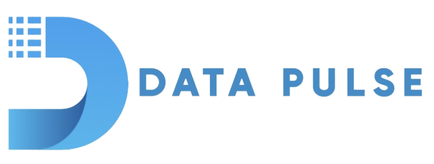

# Data Pulse

    Data Pulse ~ Professional Team to Take Your Business To The Next Level

Data Pulse merupakan sebuah Digital Agency yang menyediakan solusi terdepan dalam memajukan bisnis Anda dalam era digital. Dengan tim yang Profesional, kami telah membantu ratusan client untuk memajukan bisnis mereka. Kami fokus pada 5 layanan utama yaitu:

1. **_Search Engine Optimization_**
2. **_Social Media Management_**
3. **_Ads Management_**
4. **_E-commerce Solution_**
5. **_Web Design Solution_**

Untuk memeberikan pelayanan terbaik dari setiap jasa yang kami tawarkan, kami menerapkan beberapa **_Values_** yang mendarah daging dalam keseharian kami yaitu:

-   **_Adaptibility_**

    Mengikuti perubahan dan bersikap fleksibel dalam menjelajahi lanskap digital yang terus berkembang, memastikan relevansi dan ketangguhan dalam semua usaha.

-   **_Trust_**

    Kami memprioritaskan kepercayaan sebagai dasar setiap interaksi dengan klien dan mitra bisnis.

-   **_Innovation_**

    Kami berkomitmen untuk terus mencari cara baru untuk meningkatkan dan mengoptimalkan layanan kami.

-   **_Collaboration_**

    Kami percaya kolaborasi yang kuat antara tim dan klien menghasilkan hasil terbaik.

-   **_Quality_**

    Kami menetapkan standar tinggi untuk kualitas layanan dan hasil yang kami hasilkan.

-   **_Responsibility_**

    Kami bertanggung jawab kepada klien, tim, dan masyarakat, berusaha untuk memberikan dampak positif dalam semua yang kami lakukan.

Untuk mengetahui lebih lanjut dapat mengunjungi link berikut [Data Pulse Website](https://philportfolio.site)

---

## Desain Website

Data Pulse merupakan sebuah Digital Agency yang menangani berbagai hal dengan tujuan utama yaitu meningkatkan bisnis _client_. Dalam setiap kolaborasi dengan _client_, tentu _client_ perlu untuk percaya bahwa bisnis mereka akan di-_handle_ oleh Tim kami di **Data Pulse**. Karena hal tersebut kami ingin ketika _client_ membuka website kami, mereka percaya dengan kualitas pelayanan kami. Sebab oleh itu, berikut alasan pemilihan warna dalam pembuatan _website_ dari **Data Pulse**

| Warna   | Makna                                                                                                                                                                                                        |
| ------- | ------------------------------------------------------------------------------------------------------------------------------------------------------------------------------------------------------------ |
| Biru    | Warna biru sebagai warna utama dari website **Data Pulse** mencerminkan atau dikaitkan dengan **_Kepercayaan, Ketenangan, dan Profesionalisme_**                                                             |
| Putih   | Warna putih yang terdapat pada beberapa latar bagian website **Data Pulse** selain bertujuan untuk memberikan kontras yang baik dan membuat website enak dilihat, warna ini mencerminkan **_Kesederhanaan_** |
| Abu-Abu | Warna abu-abu yang terdapat pada bagian **_Our Services_** selain bertujuan untuk menonjolkan jasa-jasa yang ditawarkan, juga bermanfaat untuk menunjukan nila **_Kestabilan, Kekuatan dan Keteraturan_**    |

Selanjutnya, kami memilih font **_Sans-serif_** karena beberapa alasan sebagai berikut:

-   Memberikan kesan **bersih, modern, dan mudah dibaca**
-   Memberikan fokus pada konten utama, meningkatkan keterbacaan, dan memastikan pengalaman pengguna yang nyaman
-   Mencerimkan nilai-nilai kesederhanaan, kejelasan, dan keterbacaan, yang **penting untuk menyampaikan pesan dengan jelas dan efektif** kepada pengunjung website
